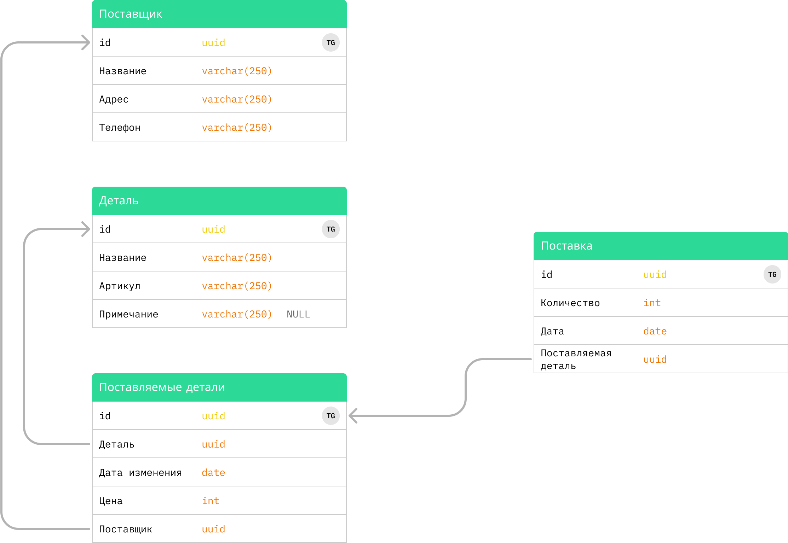

*Educational purpose. Service for inputting auto parts purchases*

## ~ Start an app ~

### Deps

1. jdk-17
2. maven2
3. docker-compose

### Starting

Build an application and then run docker-compose
```
mvn clean package -P build
```
```
docker-compose up
```

### API
http://localhost:8080/sadbe/api/swagger-ui/index.html

## ~ How it works ~

### Framework & Libraries

* Java 17
* Maven
* Spring Boot
* Jooq - ORM
* Liquibase - Migrations
* PostgreSQL

### Database Structure

